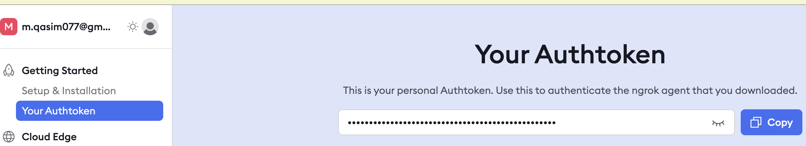

## Using Ngrok to Expose a Local Ollama Instance on Google Colab and Access It from Your Local Computer

To interact with Ollama from Google Colab, you can expose your local Ollama instance running on Colab to the internet using Ngrok. This setup allows you to leverage the computational power and internet speed of Colab while accessing the server from your local machine.

**Steps to Set Up and Access Ollama on Colab:**

**1. Obtain an Ngrok Token**
 - First, acquire your Ngrok authentication token.
</img>
